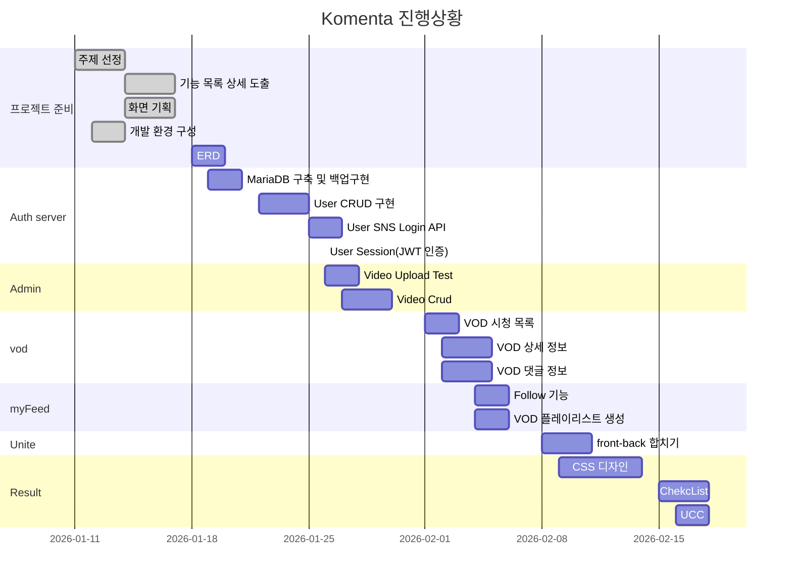

# Komenta

[TOC]

## 팀원 소개

- 테크리더 : 배상웅

- 기획 : 정혜림

- QA : 김채린, 박수아

- Git Master : 고재석

## 주제

- 프로젝트명 : Komenta

  > 독일어 'Kommentar'에서 파생. (Commentary)

- VOD 영상 플랫폼에서 영상 재생 시간별로 댓글과 연동하여 사용자에게 더 큰 재미를 주는 서비스를 제공한다.

## 기능

1. 회원 관리

2. 로그인 관리

3. 어드민 기능

4. VOD 관리

5. 화면 구성

## 개발문서

https://docs.google.com/spreadsheets/d/1f44yO4aeAmSMDSMzdjwmA0yPJ5i3DKCw0QpL_Lu572M/edit#gid=0

## Gantt Chart

## Stack

</a>
</a>
</a>

</a>
</a>

</a>
</a>

## Code Style

## Git Rule

### branch

`master -> develop -> feature/FE/{기능이름}-{상세기능}(김채린, 박수아, 정혜림) or feature/BE/{기능이름}-{상세기능}(고재석, 배상웅)`

### merge

``

### commit

``

## ERD

